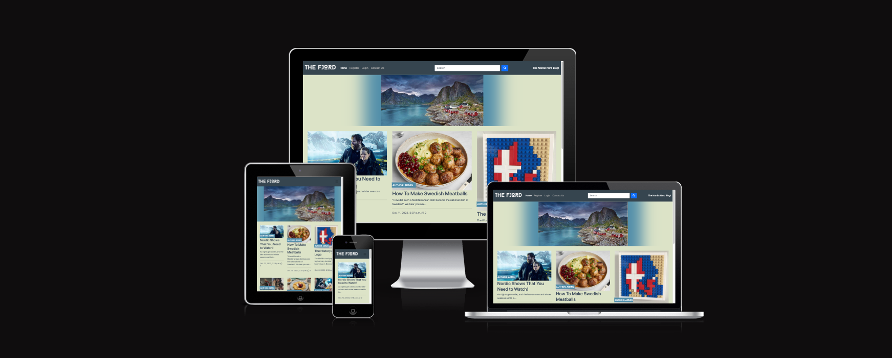
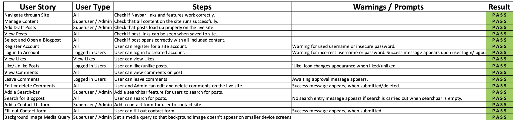
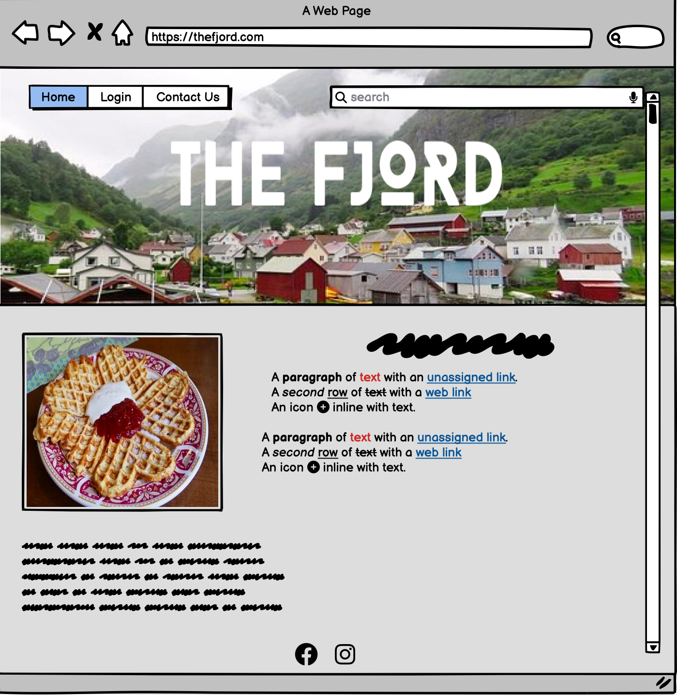

# The Fjord #

'The Fjord,' is my Project 4 submission, under the 'Project Idea 0' choice of build and design. The site is a blogsite that focuses on all things Nordic! The site features interesting and quirky facts about the Nordic countries. Users have the ability to create profiles on the site, login, like posts, and leave comments. Those with or without a site profile, can search the site for posts using the searchbar on the navbar. They can also fill out a contact form, which displays a success message, when their message is sent. 

# User Experience - UX #

### User Stories

* As a Site User, I can:

1. Navigate through the Site
2. View the collection of blogposts on the home page and select each one for viewing. 
3. Read each blogpost, with no issues, on any screen size. 
4. Sign up for an account on the site. 
5. Search for posts by using the searchnar on the navbar. 
6. Find specific posts from my search results.
7. Fill out a contact form.
8. Receive a 'Success' message when contact form is submitted. 

* As a registered Site User, I can:

1. Log in to the site. 
2. Like/Unlike posts on their respective pages.
3. Submit a comment  on a post, to be approved by the site admin.
4. Have my approved comment appear on the live site. 
5. Edit or delete their comments, in line with CRUD functionality.

* As a Site Admin, I can:

1. Create, edit, add images and links, and delete posts.
2. I can save posts as drafts, or publish them upon completion.
3. Approve interactions with the site, by approving and publishing, editing, or deleting comments on posts, in line with CRUD functionality.. 

Alongside the logging of my User Stories, I ran manual tests for each of them, and logged the results on a Microsof Excel file. Here are my results:

### Methodology Used - Agile

I completed my tasks by using the Agile methodod of task management. I found this method very helpful and rewarding to my work. I added User Story issues to my Githup Projects tab on this site's repository page, which can be viewed [here](https://github.com/users/CathalSweeney6/projects/5/views/1).

### Planning Out My Project

I originally planned on creating a Django site for a restrarant that served Nordic Food, but I found my plans, along with other aspects such as the design and menu, lacking and uninteresting. I instead opted for creating a blog site, that's posts would focus on different aspects of Nordic culture. 

### The Fjord - Site Goals

* To provide Site Users with an intriguing, easily accessable, and well formatted site, with neat, clear and muted design choices. 
* To appeal to all users and, not just a niche selection. 
* To provide registered Site Users with the ability to interact with the site, throgh likes and comments. 
* To make sure that all blogpost taglines and images are to the point and appealing to Site Users. 
* To make sure that posts can be easily found bt use of the searchbar. 
* To make sure that the site runs smoothly on all screen sizes and devices. 

### Wireframe Design

Prior to writing any code, I designed the wireframe for my site using Balsamiq. The wireframe differred slightly from the finished project, though the basic mainframe idea was there. 

### Site Design and Layout

#### Colour Scheme 

I reasearched other sites that focused on Nordic aspects. I found that these sites shared a common feature of a muted colour scheme. I took this inspiration onboard and began to design my site. 
I chose a muted charcoal tone for the navbar and blog tagline text.
I chose a muted green colour for the main site background colour. I found this shade of green reflected the natural aspect of the Nordic landscape. 
I chose a muted blue for the author tags and buttons, as I beleive it contrasts well against the muted green background and charcoal elements. 

#### Site Logo and Typography

I wanted the site's logo to be font-based, and I wanted the selected font to be reflective of the sites focus on Nordic culture. I chose 'Baron Neue,' as I thought the font's modernity, along with its rugged, angular style, reflected this the most. 

I also chose to include the 'Roboto' and 'Raleway' fonts as fonts for the sites text, as they are clear and have been reliable on previous projects. 

#### Hero Image 

The site features a Hero Image of Norway's Lofoten Islands. This image is surrounded by a box-shadow that blends the image into the background more. I chose this image as I features idyllic imagery of coastal cottages and fjords. The image is media-queried out of display on smaller devices, to make navigating the site and reading blogposts easier for users. 

#### Favicon Image

I added a favicon file to my project which loads up alongside the site's name in the browser tab.

### Features 

#### Navbar

The Navbar features The sites logo, which also acts as a link to the home page, along with links to the home page, the login/logout page, the register page, the contact form page, and the searchbar, where they can search for posts. The Navbar also includes the site's tagline, 'The Nordic Nerd Blog!'

#### Collection of Blogposts

The homwe page shows all of the submitted blogpost links in order of publication. The blogpost links feauture the post's featured image, along with a tagline and a snipped of the post. Users can click on each post and read the post on the specific post detail page, once loaded. 

#### Post Detail Page

The post detail page features the post in full, along with its specific featured image. Underneat each post, users are promted to either sign in or sign up for an account, should they wish to like the post or leave a comment for submission. This promt includes links to the 'Login' and 'Register' pages. 

#### The 'Next' Button

The home screen paginates blogposts with a post cutoff of 6, per page. Users can click the 'Next' button, above the site's footer, to load more blogposts. 

#### 'Like' Button and Comment Section

Once the user is logged in, the sign in/sign up prompt isn't displayed. They can now like and unlike the post and submit comments, to be approved by the site admin.

#### Account Register Page 

Users wishing to create an account on the website can do so by registering for an account on the Register page. The user must create a username and secure password, and will be warned if the latter isn't so. They can also add an optional email address to their account upon registering. 

#### Login Page

Users enter their username and password into this page and can successfully login. When logged in, the user us redirected to the home page and will be greeted with a 'Successfully logged in as "..."' message. 

#### Logout 

When logged in, the 'Logout' link sits in the place of the 'Login' link, on the Navbar. Users click the link and are asked if they want to sign out. Upon signing out, they are redirected to the home page and a message informs them that they have successfully signed out. 

#### Contact Form

Users can contact the site by clicking the 'Contact Us' link on the navbar. Users can then enter their name, email and message into a contact form. When the user clicks the 'Submit' button on the contact form, they are directed to the  'Success' page. 

#### Success Page

The success page displays a message that informs the user that their message was sent successfully. Here, they can easily return to the home page, by simply clicking on the site's logo or 'Home' link, on the Navbar. 

#### Footer

The site's footer is similar in style to the navbar and features icons as links to Facebook, Twitter, Instagram and YouTube. 

### Superuser / Admin Site 

As a site Admin, I could create, edit and delete posts on the site, as well as approve user comments, and monitor and delete user profiles and email addresses, by using the built in Django administration site for my project. 

### Database Diagram

I used LucidChart to create a Database Diagram for my project.

## Technologies Used 

### Site Languages

* HTML
* CSS
* Django
* JavaScript
* Python

#### Django Packages

* Gunicorn
* Cloudinary
* DJ-database-url
* Pyscopg2 
* Summernote 
* Allauth 
* Crispy Forms 

### Frameworks, and Misc. Libraries and Programs

* Gitpod
* Github
* Fontawesome
* Google Fonts
* cdnfonts.com
* PostgreSQL
* Google/Chrome Developer Tools
* Lucidchart
* Heroku 

### Site Testing 

Testing was carried out eztensivley whilst creating and publishing my site. As my project featured various different elements interacting with one another, I wanted to insure that everything ran correctly. I checked my site's console and had zero issues. 

#### Lighthouse 

I tested my site on Google's 'Lighhouse' feature, which pointed out ways in which I could improve the website for a smoother load-time and better user experience on desktop, tablet and mobile. I took Lighthouse's advice onboard and was delighted with my results. 

#### W3 HTML Validation 

I ran my html through W3's html validation site and received no errors. 

#### W3 CSS Validation 

I also ran my CSS through W3's CSS validation site and received no errors. 

#### Python Validation 

I validated the Pyhon files of my project using Code Institute's Python Linter. My code was found to have no errors on each file. 

#### JavaScript Validation 

My site includes one block of JavaScript, that times out pop-up messages, such as the  'Successfully logged in as "...",' and 'Your comment is awaiting approval' messages. I ran my JavaScript through ExtendsClass' JavaScript validator. My JavaScript code was found to be free of errors and was syntactically valid. 

#### Frontend

* Users can successfully register, login and logout of their accounts on the site, as well as like posts, leave comments and fill out a contact form.  Messages appear on the screen when Users complete these actions. 
* When a User wishes a create an account, or log in, they are promted to fill in the required fields, in order to do so. 
* All links in the site work, allowing the user to access all of the posts, and navbar sections, as well as the external social media icon links in the site's footer.
* The site is successfully paginated, with the number of posts, per-page, cutting off at six. Users can acccess the remainder of the posts by clicking the 'Next' button that sits above the footer section. 
* CRUD functionality is established for Users, as they have the ability to like/unlike posts, as well as the ability to submit, post, edit and delete comments. 

#### Backend 

* The Superuser/Admin can monitor, edit and delete saved email addresses, and submitted comments, if they wish, from the Django Admin site. 
* When creating a post, the Superuser/Admin is promted to fill in the required fields, in order to do so. 

### Bugs

I luckily only had a couple of bugs to deal with during the creation of this project. These were instantly spotted and fixed, through being notified of them in the 'Problems' tab on my Gitpod panel, and through Django Error messges that appeared when editing and previewing my site on Gitpod. 

## Setting Up a Django App

1. Firstly, open the [Code Institute Gitpod Full Template](https://github.com/Code-Institute-Org/gitpod-full-template). 
2. Use this template to create a new Github repository.  
3. Once the reposotory is set up, use the github terminal to instnstall Django and gunicorn to you workspace, by entering in: `pip3 install 'django<4' gunicorn`.
4. Next install the database libraries dj_database_url and psycopg2, by entering in: `pip3 install dj_database_url==0.5.0 psycopg2`.
5. Create a requirements file by enteringn: `pip freeze --local > requirements.txt`.
6. Create your project, by entering in: `django-admin startproject desired_projcect_name_goes_here`.
7. Create your Django app, by entering in: `python3 manage.py startapp desired_app_name_goes_here`.
8. Enter your apps's name into the list of installed apps in your settings.py file.
9. Migrate changes to your project by entering in: `python3 manage.py migrate`.
10. Check to see if your Django app is successfully set up, by running the server, by entering in: `python3 manage.py runserver`.
11. By following these instructions, the app should be successfully set up. The server will show a 'succesfully installed' message from Django. 

## Deployment to Heroku

1. Log in to your [Heroku](https://id.heroku.com) account, and select Create New App from the menu. 
2. Enter your desired app name, then select your region, in order to create the app. 
3. Use ElephantSQL to create a database. Log in, create a new instance, and name your plan through their Tiny Turtle Free Plan. Select your region and datacentre, and review your instance before creating. 
4. Copy your database URL from your ElephantSQL dashboard. 
5. Return to your gitpod workspace, create a new file called env.py and ensure that this file is included in your gitignore file list.
6. Next, add the env.py file to your settings.py file. Swap the insecure key in your settings.py file with the new `SECRET_KEY = os.environ.get('SECRET_KEY')`. Then, replace the database in settings.py with `DATABASES = {'default': dj_database_url.parse(os.environ.get("DATABASE_URL"))}`. Enter your secret key, along with your database information to the env.py file and migrate all changes. 
7. Create a Cloudinary account. Once created, copy your API authentication information from your profile.  Add this information to your env.py file, under `CLOUDINARY_URL`. Add cloudinary_libraries to the list of installed apps in your settings.py file, `STATICFILES_STORAGE`, `Cloudinary_storage.storage.StaticHashedCloudinaryStorage`, and connect your base directory to static, by using `os.path.join`, and create a static route.  to connect our base directory to static and set up static route. Follow these steps to establish a  media URL,  `Cloudinary_storage.storage.MediaCloudinaryStorage`.
8. Add `TEMPLATES_DIR =  os.path.join(BASE_DIR, 'templates')` under your base direcory in your settings.py file. Change the D-I-R-S key to align towards the new templates directory variable. 
9. In your settings.py file, add your Heroku host name into the list of allowed hosts, whilst additionally adding 'localhost'. 
10. Create a new Procfile: `web: gunicorn your_project_name.wsgi`.
11. In Heroku, reveal your Config Vars and add a SECRET_KEY, the `CLOUDINARY_URL`, `DISABLE_COLLECTSTATIC =, the DATABASE_URL, and set your PORT to 8000.
12. Select Github as the deployment method connect to your GitHub repository.
13. Configure your desired deployment setting in the Deploy tab. 
15. Choose whether to 'Enable Automatic Deploys,' for automatic deployment when you push updates to Github, or not.

## Final Deployment to Heroku 

1. Create a runtime.txt: `python-3.8.13`. 
2. Ensure that  `DEBUG = False` in settings.py before any deployment. 
3. Add: `X_FRAME_OPTIONS = SAMEORIGIN` to settings.py.
4. In Heroku settings, delete the config vars entry: `DISABLE_COLLECTSTATIC = 1`. 
5. You can now deploy your app to Heroku!

### Credits 

* This project was inspired by the Code Institute 'I Think, Therefore I Blog' walkthrough project. 
* The site's logo font was taken from [cdnfonts.com](https://www.cdnfonts.com/baron-neue.font). 
* The Site's icons were taken from [fontawesome.com](https://fontawesome.com). 
* The site's hero image was taken from [Pixabay.com](https://pixabay.com/) and uploaded using Cloudinary. 
* Some of the Blogpost's featured images were taken from [Pexels.com](https://pexels.com/).
* The 'Nordic Shows' Blogpost featured image was taken from [BBC.com](https://www.bbc.co.uk/programmes/m0002qyz). 
* The 'Lego' Blogpost featured image was taken from [ideabrickworks.com](https://ideabrickworks.com/the-art-and-fun-of-the-mosaic/). 
* The 'Thor' Blogpost featured image was taken from [CBR.com](https://www.cbr.com/marvel-thor-norse-mythology-same-different/). 
* The 'Finland' Blogpost featured image was taken from [Heavymetalknitting.com](https://heavymetalknitting.com/). 
* The 'Iceland' Blogpost featured image was taken from [Whatson.is](https://www.whatson.is/five-really-very-strong-icelanders-mens-edition/). 
* The Swedish Meatball recipe was taken from [Sweden.se](https://sweden.se/culture/food/swedish-meatballs). 
* The Hjertevafler recipe was taken from [Norway With Pål](https://www.youtube.com/watch?v=I0jF8iE5BYQ&embeds_referring_euri=https%3A%2F%2Fnorwaywithpal.com%2F&embeds_referring_origin=https%3A%2F%2Fnorwaywithpal.com&source_ve_path=MjM4NTE&feature=emb_title). 

### Resources Used

* Stack Overflow 
* W3Schools
* The searchbar and contact form were created by following turorials by [Codemy.com](https://www.youtube.com/watch?v=AGtae4L5BbI).
* The edit/delete User comment feature was created by follwoig a tutorial by [Medium.com](https://legionscript.medium.com/building-a-social-media-site-with-python-and-django-part-4-edit-delete-posts-add-comments-8e6ca1ef0441). 