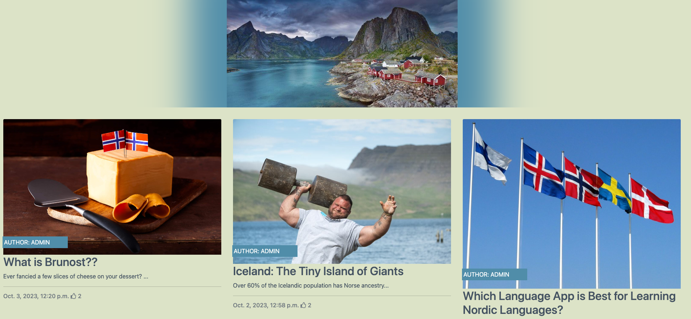
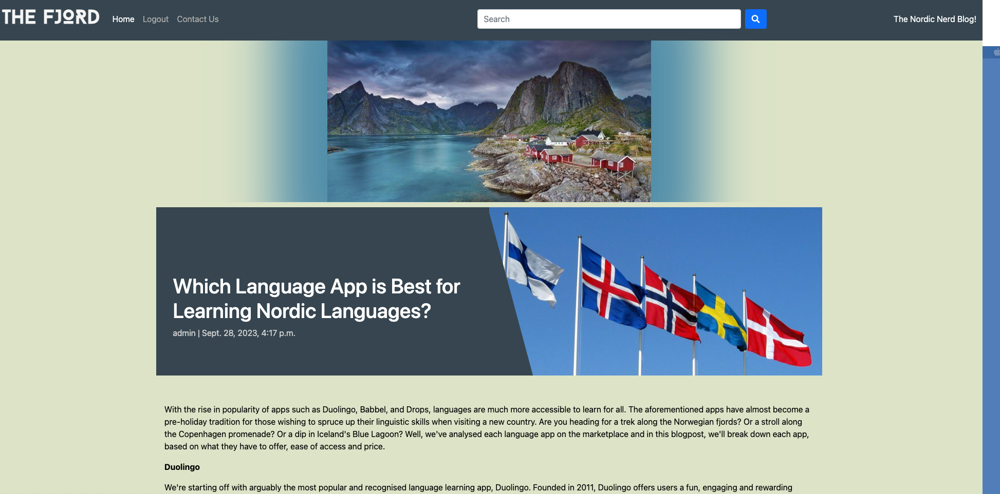
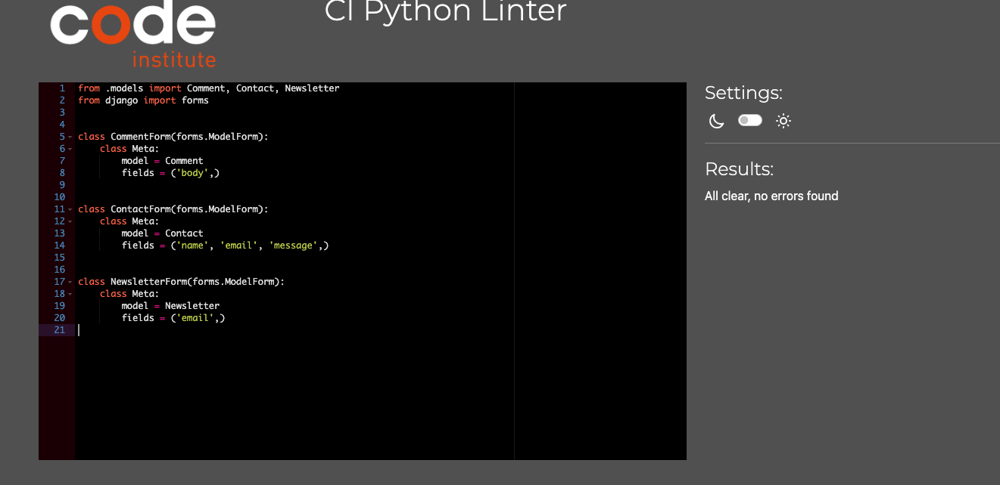

# The Fjord #

'The Fjord,' is my Project 4 submission, under the 'Project Idea 0' choice of build and design. The site is a blogsite that focuses on all things Nordic! The site features interesting and quirky facts about the Nordic countries. Users have the ability to create profiles on the site, login, like posts, and leave comments. Those with or without a site profile, can search the site for posts using the searchbar on the navbar. They can also fill out a contact form, which displays a success message, when their message is sent. 


# User Experience - UX #

### User Stories

* As a Site User, I can:

1. Navigate through the site.
2. View the collection of blogposts on the home page, and select each one for viewing. 
3. Read each blogpost, with no issues, on any screen size. 
4. Sign up for an account on the site. 
5. Search for posts by using the searchbar on the navbar. 
6. Find specific posts from my search results.
7. Fill out a contact form.
8. Receive a 'Success' message, when contact form is submitted. 

* As a registered Site User, I can:

1. Log in to the site. 
2. Like/unlike posts, on their respective pages.
3. Submit a comment on a post, to be approved by the site admin.
4. Have my approved comment appear on the live site. 
5. Edit or delete their comments, in line with CRUD functionality.

* As a Site Admin, I can:

1. Create, edit, add images and links, and delete posts.
2. I can save posts as drafts, or publish them upon completion.
3. Approve interactions with the site, by approving and publishing, editing, or deleting comments on posts, in line with CRUD functionality. 

Alongside the logging of my User Stories, I ran manual tests for each of them, and logged the results on a Microsoft Excel file. Here are my results:


### Agile Methodology

I completed my tasks by using the Agile method of task management. I found this method very helpful and rewarding to my work. I added User Story issues to my Github Projects tab on the site's repository page, which can be viewed [here](https://github.com/users/CathalSweeney6/projects/5/views/1).

### Planning Out My Project

I originally planned on creating a Django site for a restaurant that served Nordic food, but I found my plans, along with other aspects, such as the design and menu, lacking and uninteresting. I instead, opted for creating a blog site, thats posts would focus on different aspects of Nordic culture. 

### Site Goals

* To provide site users with an intriguing, easily accessable, and well formatted site, with neat, clear and muted design choices. 
* To appeal to all users and, not just a niche selection. 
* To provide registered site users with the ability to interact with the site, through likes and comments. 
* To make sure that all blogpost taglines and images are to the point, and appealing to site users. 
* To make sure that posts can be easily found by use of the searchbar. 
* To make sure that the site runs smoothly on all screen sizes and devices. 

### Wireframe Design

Prior to writing any code, I designed the wireframe for my site using Balsamiq. The wireframe differred slightly from the finished project, though the basic mainframe idea was there. 


### Site Design and Layout

#### Colour Scheme 

I researched other sites that focused on Nordic aspects. I found that these sites shared a common feature of a muted colour scheme. I took this inspiration on board and began to design my site. 
I chose a muted charcoal tone for the navbar and blog tagline text.


I chose a muted green colour for the main site background colour. I found this shade of green reflected the natural aspect of the Nordic landscape. 



I chose a muted blue for the author tags and buttons, as I believe it contrasts well against the muted green background and charcoal elements. 


#### Site Logo and Typography

I wanted the site's logo to be font-based, and I wanted the selected font to be reflective of the site's focus on Nordic culture. I chose 'Baron Neue,' as I thought the font's modernity, along with its rugged, angular style, reflected this the most. 


I also chose to include the 'Roboto' and 'Raleway' fonts as fonts for the sites text, as they are clear and have been reliable on previous projects. 

#### Hero Image 

The site features a Hero Image of Norway's Lofoten Islands. This image is surrounded by a box-shadow, that blends the image into the background more. I chose this image as it features idyllic imagery of coastal cottages and fjords. The image is media-queried out of display on smaller devices, to make navigating the site, and reading blogposts, easier for users. 


#### Favicon Image

I added a favicon file to my project, that loads up alongside the site's name in the browser tab.


#### Admin Profile Picture

I added a profile picture for the site admin, that loads up alongside their author tab, on post previews.


#### Commenter Profile Picture

I added a profile picture for those that have commented on a post, this loads up alongside their username, in the comment section of each post.


### Features 

#### Navbar

The navbar features the site's logo, which also acts as a link to the home page, along with links to the home page, the login/logout page, the register page, the contact form page, and the searchbar, where users can search for posts. The navbar also includes the site's tagline, 'The Nordic Nerd Blog!'


#### Collection of Blogposts

The home page shows all of the submitted blogpost links in order of publication. The blogpost links feature the post's featured image, along with a tagline and a snippet of the post. Users can click on each post and read the post on the specific post detail page, once loaded. 


#### Article Detail Page

The post detail page features the post in-full, along with its specific featured image. Underneath each post, users are prompted to either sign in, or sign up for an account, should they wish to like the post, or leave a comment for submission. This prompt includes links to the 'Login' and 'Register' pages. 




#### The Next Button

The home screen paginates blogposts with a post cut-off of 6, per page. Users can click the 'Next' button, above the site's footer, to load more blogposts. 


#### Like Button and Comments Section

Once the user is logged in, the sign in/sign up prompt isn't displayed. They can now like and unlike the post and submit comments, to be approved by the site admin.


#### Edit Comments Page 

Logged in Users have the ability to add, edit or delete their own comments. The Superuser/Admin can also complete this action.


#### Search Results Page 

All users can use the searchbar on the navbar to search for posts, by word. If the search contains no characters, they will be prompted to enter their query into the searchbar. 


#### Account Register Page 

Users wishing to create an account on the website, can do so by registering for an account on the 'Register' page. The user must create a username and secure password, and will be warned if the latter isn't so. They can also add an optional email address to their account, upon registering. 


#### Login Page

Users enter their username and password into this page and can successfully login. When logged in, the user is redirected to the home page and will be greeted with a 'Successfully logged in as "..."' message. 


#### Logout Page

When logged in, the 'Logout' link sits in the place of the 'Login' link, on the navbar. Users click the link, and are asked if they want to sign out. Upon signing out, they are redirected to the home page and a message informs them that they have successfully signed out. 


#### Contact Form

Users can contact the site by clicking the 'Contact Us' link on the navbar. Users can then enter their name, email and message into a contact form. When the user clicks the 'Submit' button on the contact form, they are directed to the 'Success' page. The Contact form is connected to the models.py, urls.py, forms.py and, views.py and admin.py files, meaning that when a message is sent, the site admin can view their message in the admin page. 


#### Success Page

The success page displays a message, that informs the user that their message was sent successfully. Here, they can easily return to the home page, by simply clicking on the site's logo or 'Home' link, on the navbar. 


#### Newsletter Page

The Newsletter page allows users, that wish to subscribe to the site's newsletter, to submit their email address to the mailing list, which is viewable by the admin on the admin page. 


#### Newsletter Success Page

The newsletter success page displays a message, that informs the user that they have been added to the mailing list. Here, they can easily return to the home page, by simply clicking on the site's logo or 'Home' link, on the navbar. 


#### Footer

The site's footer is similar in style to the navbar, and features icons as links to Facebook, Twitter, Instagram and YouTube. 


### Superuser / Admin Site 

As a site Admin, I could create, edit and delete posts on the site, as well as approve user comments, and monitor and delete user profiles and email addresses, by using the built in Django administration site, for my project. 


### Database Diagram

I used LucidChart to create a Database Diagram for my project.


## Technologies Used 

### Site Languages

* HTML
* CSS
* Django
* JavaScript
* Python

#### Django Packages

* Gunicorn
* Cloudinary
* DJ-database-url
* Pyscopg2 
* Summernote 
* Allauth 
* Crispy Forms 

### Frameworks, and Misc. Libraries and Programs

* Gitpod
* Github
* Fontawesome
* Google Fonts
* cdnfonts.com
* PostgreSQL
* Google/Chrome Developer Tools
* Lucidchart
* Heroku 

### Site Testing 

Testing was carried out extensively, whilst creating and publishing my site. As my project featured various different elements interacting with one another, I wanted to insure that everything ran correctly. I checked my site's console, and had zero issues. 


#### Lighthouse 

I tested my site on Google's 'Lighthouse' feature, which pointed out ways in which I could improve the website for a smoother load-time and better user experience on desktop, tablet and mobile. I took Lighthouse's advice on board and was delighted with my results. 


#### W3 HTML Validation 

I ran all of my html through W3's html validation site, and received no errors. 


#### W3 CSS Validation 

I also ran my CSS through W3's CSS validation site, and received no errors. 


#### Python Validation 

I validated the Python files of my project using Code Institute's Python Linter. My code was found to have no errors on each file. 





#### JavaScript Validation 

My site includes one block of JavaScript, that times out pop-up messages, such as the  'Successfully logged in as "...",' and 'Your comment is awaiting approval' messages. I ran my JavaScript through ExtendsClass' JavaScript validator. My JavaScript code was found to be free of errors and was syntactically valid. 


#### Frontend

* Users can successfully register, login and logout of their accounts on the site, as well as search for posts, like posts, leave comments and fill out a contact form.  Messages appear on the screen when users complete these actions. 
* When a user wishes to create an account, or log in, they are prompted to fill in the required fields, in order to do so. 


* All links in the site work, allowing the user to access all of the posts, and navbar sections, as well as the external social media icon links in the site's footer.
* The site is successfully paginated, with the number of posts, per-page, cutting off at six. Users can access the remainder of the posts by clicking the 'Next' button that sits above the footer section. 
* CRUD functionality is established for users, as they have the ability to like/unlike posts, as well as the ability to submit, post, edit and delete comments. 


#### Backend 

* The Superuser/Admin can monitor, edit and delete saved email addresses, and submitted comments, if they wish, from the Django Admin site. 
* When creating a post, the Superuser/Admin is prompted to fill in the required fields, in order to do so. 

### Bugs

I luckily only had a couple of bugs to deal with, during the creation of this project. These were instantly spotted and fixed, through being notified of them in the 'Problems' tab on my Gitpod panel, and through Django error messages that appeared when editing and previewing my site on Gitpod. 

## Setting Up a Django App

1. Firstly, open the [Code Institute Gitpod Full Template](https://github.com/Code-Institute-Org/gitpod-full-template). 
2. Use this template to create a new Github repository.  
3. Once the repository is set up, use the Github terminal to install Django and Gunicorn to your workspace, by entering in: `pip3 install 'django<4' gunicorn`.
4. Next install the database libraries, dj_database_url and psycopg2, by entering in: `pip3 install dj_database_url==0.5.0 psycopg2`.
5. Create a requirements file by entering in: `pip freeze --local > requirements.txt`.
6. Create your project, by entering in: `django-admin startproject desired_project_name_goes_here`.
7. Create your Django app, by entering in: `python3 manage.py startapp desired_app_name_goes_here`.
8. Enter your app's name into the list of installed apps, in your settings.py file.
9. Migrate changes to your project by entering in: `python3 manage.py migrate`.
10. Check to see if your Django app is successfully set up, by running the server, by entering in: `python3 manage.py runserver`.
11. By following these instructions, the app should be successfully set up. The server will show a 'successfully installed' message from Django. 

## Deployment to Heroku

1. Log in to your [Heroku](https://id.heroku.com) account, and select 'Create New App' from the menu. 
2. Enter your desired app name, then select your region, in order to create the app. 
3. Use ElephantSQL to create a database. Log in, create a new instance, and name your plan through their 'Tiny Turtle' free plan. Select your region and datacentre, and review your instance, before creating. 
4. Copy your database URL from your ElephantSQL dashboard. 
5. Return to your Gitpod workspace, create a new file called env.py and ensure that this file is included in your gitignore file list.
6. Next, add the env.py file to your settings.py file. Swap the insecure key in your settings.py file, with the new `SECRET_KEY = os.environ.get('SECRET_KEY')`. Then, replace the database in settings.py with `DATABASES = {'default': dj_database_url.parse(os.environ.get("DATABASE_URL"))}`. Enter your secret key, along with your database information to the env.py file, and migrate all changes. 
7. Create a Cloudinary account. Once created, copy your API authentication information from your profile.  Add this information to your env.py file, under `CLOUDINARY_URL`. Add cloudinary_libraries to the list of installed apps in your settings.py file, `STATICFILES_STORAGE`, `Cloudinary_storage.storage.StaticHashedCloudinaryStorage`, and connect your base directory to static, by using `os.path.join`, and create a static route.  To connect your base directory to static and set up static route, Follow these steps to establish a media URL,  `Cloudinary_storage.storage.MediaCloudinaryStorage`.
8. Add `TEMPLATES_DIR =  os.path.join(BASE_DIR, 'templates')` under your base directory in your settings.py file. Change the D-I-R-S key to align towards the new templates directory variable. 
9. In your settings.py file, add your Heroku host name into the list of allowed hosts, whilst additionally adding 'localhost'. 
10. Create a new Procfile: `web: gunicorn your_project_name.wsgi`.
11. In Heroku, reveal your Config Vars and add a SECRET_KEY, the `CLOUDINARY_URL`, `DISABLE_COLLECTSTATIC =1`, the DATABASE_URL, and set your PORT to 8000.
12. Select Github as the deployment method to connect to your Github repository.
13. Configure your desired deployment setting in the 'Deploy' tab. 
15. Choose whether to 'Enable Automatic Deploys,' for automatic deployment, when you push updates to Github, or not.

## Final Deployment to Heroku 

1. Create a runtime.txt, by entering: `python-3.8.13`. 
2. Ensure that  `DEBUG = False` in settings.py before any deployment. 
3. Add: `X_FRAME_OPTIONS = SAMEORIGIN` to settings.py.
4. In Heroku settings, delete the Config Vars entry: `DISABLE_COLLECTSTATIC = 1`. 
5. You can now deploy your app to Heroku!

---

The live deployed application can be found deployed on [Heroku](https://thefjord-b1491443270e.herokuapp.com).

### ElephantSQL Database

This project uses [ElephantSQL](https://www.elephantsql.com) for the PostgreSQL Database.

To obtain your own Postgres Database, sign-up with your GitHub account, then follow these steps:

- Click **Create New Instance** to start a new database.
- Provide a name (this is commonly the name of the project: The Fjord).
- Select the **Tiny Turtle (Free)** plan.
- You can leave the **Tags** blank.
- Select the **Region** and **Data Center** closest to you.
- Once created, click on the new database name, where you can view the database URL and Password.

### Cloudinary API

This project uses the [Cloudinary API](https://cloudinary.com) to store media assets online, due to the fact that Heroku doesn't persist this type of data.

To obtain your own Cloudinary API key, create an account and log in.

- For *Primary interest*, you can choose *Programmable Media for image and video API*.
- Optional: *edit your assigned cloud name to something more memorable*.
- On your Cloudinary Dashboard, you can copy your **API Environment Variable**.
- Be sure to remove the `CLOUDINARY_URL=` as part of the API **value**; this is the **key**.

### Heroku Deployment

This project uses [Heroku](https://www.heroku.com), a platform as a service (PaaS) that enables developers to build, run, and operate applications entirely in the cloud.

Deployment steps are as follows, after account setup:

- Select **New** in the top-right corner of your Heroku Dashboard, and select **Create new app** from the dropdown menu.
- Your app name must be unique, and then choose a region closest to you (EU or USA), and finally, select **Create App**.
- From the new app **Settings**, click **Reveal Config Vars**, and set your environment variables.

| Key | Value |
| --- | --- |
| `CLOUDINARY_URL` | user's own value |
| `DATABASE_URL` | user's own value |
| `DISABLE_COLLECTSTATIC` | 1 (*this is temporary, and can be removed for the final deployment*) |
| `SECRET_KEY` | user's own value |

Heroku needs two additional files in order to deploy properly.

- requirements.txt
- Procfile

You can install this project's **requirements** (where applicable) using:

- `pip3 install -r requirements.txt`

If you have your own packages that have been installed, then the requirements file needs updated using:

- `pip3 freeze --local > requirements.txt`

The **Procfile** can be created with the following command:

- `echo web: gunicorn app_name.wsgi > Procfile`
- *replace **app_name** with the name of your primary Django app name; the folder where settings.py is located*

For Heroku deployment, follow these steps to connect your own GitHub repository to the newly created app:

Either:

- Select **Automatic Deployment** from the Heroku app.

Or:

- In the Terminal/CLI, connect to Heroku using this command: `heroku login -i`
- Set the remote for Heroku: `heroku git:remote -a app_name` (replace *app_name* with your app name)
- After performing the standard Git `add`, `commit`, and `push` to GitHub, you can now type:
	- `git push heroku main`

The project should now be connected and deployed to Heroku!

### Local Deployment

This project can be cloned or forked in order to make a local copy on your own system.

For either method, you will need to install any applicable packages found within the *requirements.txt* file.

- `pip3 install -r requirements.txt`.

You will need to create a new file called `env.py` at the root-level,
and include the same environment variables listed above from the Heroku deployment steps.

Sample `env.py` file:

```python
import os

os.environ.setdefault("CLOUDINARY_URL", "user's own value")
os.environ.setdefault("DATABASE_URL", "user's own value")
os.environ.setdefault("SECRET_KEY", "user's own value")

# local environment only (do not include these in production/deployment!)
os.environ.setdefault("DEBUG", "True")
```

Once the project is cloned or forked, in order to run it locally, you'll need to follow these steps:

- Start the Django app: `python3 manage.py runserver`
- Stop the app once it's loaded: `CTRL+C` or `⌘+C` (Mac)
- Make any necessary migrations: `python3 manage.py makemigrations`
- Migrate the data to the database: `python3 manage.py migrate`
- Create a superuser: `python3 manage.py createsuperuser`
- Load fixtures (if applicable): `python3 manage.py loaddata file-name.json` (repeat for each file)
- Everything should be ready now, so run the Django app again: `python3 manage.py runserver`

#### Cloning

You can clone the repository by following these steps:

1. Go to the [GitHub repository](https://github.com/CathalSweeney6/thefjordblog) 
2. Locate the Code button above the list of files and click it 
3. Select if you prefer to clone using HTTPS, SSH, or GitHub CLI and click the copy button to copy the URL to your clipboard
4. Open Git Bash or Terminal
5. Change the current working directory to the one where you want the cloned directory
6. In your IDE Terminal, type the following command to clone my repository:
	- `git clone https://github.com/CathalSweeney6/thefjordblog.git`
7. Press Enter to create your local clone.

Alternatively, if using Gitpod, you can click below to create your own workspace using this repository.

[](https://gitpod.io/#https://github.com/CathalSweeney6/thefjordblog)

Please note that in order to directly open the project in Gitpod, you need to have the browser extension installed.
A tutorial on how to do that can be found [here](https://www.gitpod.io/docs/configure/user-settings/browser-extension).

#### Forking

By forking the GitHub Repository, we make a copy of the original repository on our GitHub account to view and/or make changes without affecting the original owner's repository.
You can fork this repository by using the following steps:

1. Log in to GitHub and locate the [GitHub Repository](https://github.com/CathalSweeney6/thefjordblog)
2. At the top of the Repository (not top of page) just above the "Settings" Button on the menu, locate the "Fork" Button.
3. Once clicked, you should now have a copy of the original repository in your own GitHub account!

## Credits 

* This project was inspired by the Code Institute 'I Think, Therefore I Blog' walkthrough project. 
* The site's logo font was taken from [cdnfonts.com](https://www.cdnfonts.com/baron-neue.font). 
* The site's icons were taken from [fontawesome.com](https://fontawesome.com). 
* The site's hero image was taken from [Pixabay.com](https://pixabay.com/), and uploaded using Cloudinary. 
* The site's favicon image was taken from [freepik.com](https://www.freepik.com/).
* The Admin and Commenter profile pictures were taken from [istockphoto.com](https://www.istockphoto.com/).
* Some of the blogpost's featured images were taken from [Pexels.com](https://pexels.com/).
* The 'Nordic Shows' blogpost featured image was taken from [BBC.com](https://www.bbc.co.uk/programmes/m0002qyz). 
* The 'Lego' blogpost featured image was taken from [Ideabrickworks.com](https://ideabrickworks.com/the-art-and-fun-of-the-mosaic/). 
* The 'Thor' blogpost featured image was taken from [CBR.com](https://www.cbr.com/marvel-thor-norse-mythology-same-different/). 
* The 'Finland' blogpost featured image was taken from [Heavymetalknitting.com](https://heavymetalknitting.com/). 
* The 'Iceland' blogpost featured image was taken from [Whatson.is](https://www.whatson.is/five-really-very-strong-icelanders-mens-edition/). 
* The Swedish Meatball recipe was taken from [Sweden.se](https://sweden.se/culture/food/swedish-meatballs). 
* The Hjertevafler recipe was taken from [Norway With Pål](https://www.youtube.com/watch?v=I0jF8iE5BYQ&embeds_referring_euri=https%3A%2F%2Fnorwaywithpal.com%2F&embeds_referring_origin=https%3A%2F%2Fnorwaywithpal.com&source_ve_path=MjM4NTE&feature=emb_title). 

## Resources Used

* [Stack Overflow](https://stackoverflow.com/).
* [W3Schools](https://www.w3schools.com/).
* The searchbar, contact form, and newsletter, were created by following turorials by [Codemy.com](https://www.youtube.com/watch?v=AGtae4L5BbI).
* The edit/delete user comment feature was created by following a tutorial by [Medium.com](https://legionscript.medium.com/building-a-social-media-site-with-python-and-django-part-4-edit-delete-posts-add-comments-8e6ca1ef0441). 